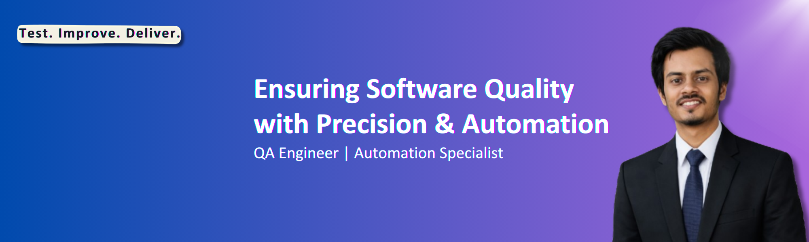

  

# Hi 👋, I'm Redoy Guho Roy

💼 Aspiring SQA Engineer  
🧪 Passionate about Software Testing & Quality Assurance  
🌍 From Bangladesh  

---

### 👨‍💻 About Me

- 🔍 Interested in IT & Software Testing field  
- 🌱 Currently learning Python Programming  
- 🤖 Exploring Automation Testing  
- 🐞 Love finding bugs & improving product quality  

---

### 🛠 Skills & Tools

---

### 🚀 Goals

- ✅ Build Automation Testing Framework  
- ✅ Improve Programming Skills  
- ✅ Contribute to Open Source Testing Projects  

---

### 📊 GitHub Stats

---

### 📫 Connect With Me

- 📧 Email: royredoyguho@gmail.com
- 💼 LinkedIn:https://www.linkedin.com/in/redoyguhoroy/
